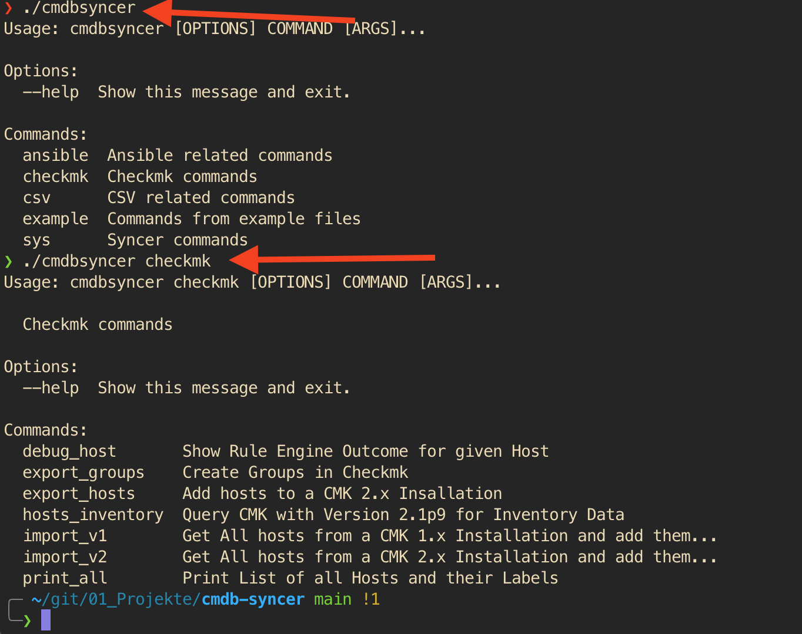

# Jobs
You need at least three Jobs for this system.
One which import the Data (source), one to export it (target). And the third is the management job who deletes old hosts from our Database (_./cmdbsyncer sys maintenance 7_, where 7 is the number of days after unavailable hosts will be deleted).

Both of them will need an Account Configuration. Please refer to the [[Account]] Section.

The ./cmdbsyncer command will list all possible jobs (Plugins automatically register new jobs). They are seperated in groups.
When you use Docker just enter: _docker exec -it cmdbsyncer_api_1 cmdbsyncer_ where cmdbsyncer_api_1 is the container name, when used with compose. 

Without docker, enter the Apps directory, load the Environment with source, and enter the command.
The Output in both cases is the same:

A job now, to export to Checkmk would be checkmk export_hosts. To run it, it would be _./cmdbsyner checkmk export_hosts ACCOUNT_. Please use in case of Docker the full path from before, account_name needs to refer to the Account Configuration you did, for the plugin to find the Credentials and Address.

As you see on the Screenshot, there are also default Checkmk 1x and 2x import Jobs, which can be used to clone or migrate Checkmk Installations Hosts. 
