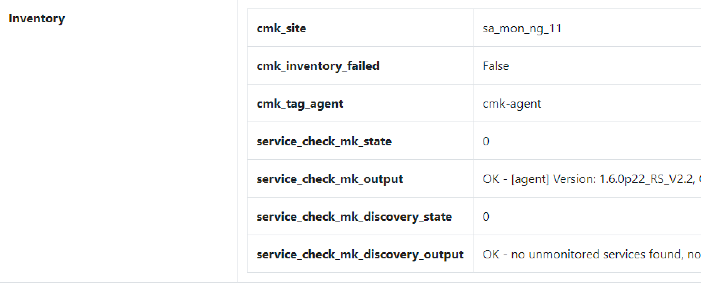
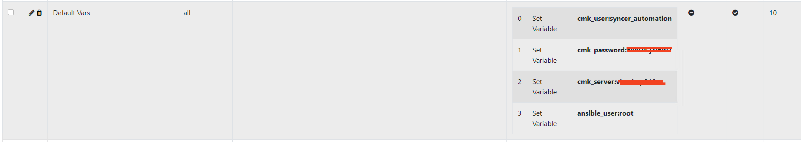
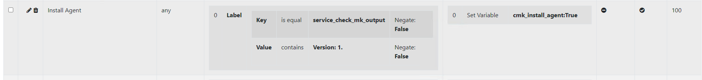
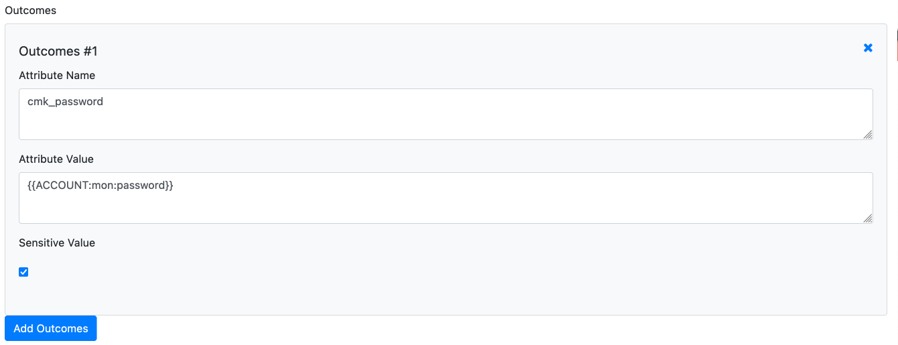

# General
The cmk_agent_mngmt.yml Playbook contains everything to manage the Installation and the Bakery and TLS Registrations of your Checkmk Agents. This works for Linux and Windows.

The job of the Syncer is, to dynamical provide variables to the Ansible Playbook, that Ansible always know what to do with each Host.

Information are inventorized for example from Checkmk self, like on which site the host is, or if the Checkmk Agent reports for example TLS errors. Also, all kind of known attributes can be used. And the Syncer Rules then created dynamic all Variables for Ansible.

## Functions

- Support for Linux and Windows
- Install Checkmk Agents
- Register Checkmk Bakery
- Register TLS for Checkmk
- Discover Host in Checkmk
- Bake and Sign Agents (See Checkmk part)
- Restart Checkmk (See Checkmk part)

## Inventorize Checkmk
To get the current Status Information about the Host, like is the Agent on Error, is the Bakery registered the inventory function of the Syncer is used. All Information found will be added to the Syncers Database. 

The Command is:
`./cmdbsyncer checkmk hosts_inventory account`. 

After the run, you can verify what the Inventory found, when you check a Host in the Frontend and Scroll to inventory:



## Ansible Variables
Next, you need to seed Variables and Conditions. This is necessary for Ansible to know if an Action is due, or which Credentials are used.

The following Variables existing in the Ansible Role. You learn later how to set them:

| Variable | Description |
| :--------|:------------|
| cmk_user | User for Auth in Checkmk and API Operations |
| cmk_secret | The Automation Secret for the User |
| cmk_server | The Site specifc Server for Registrations (Distributed Monitoring) |
| cmk_main_site | Master Site |
| cmk_main_server | Master Sites Address (with https://) |
| cmk_install_agent | True if Agent has to be installed |
| cmk_register_tls | True if TLS Registration has to be done |
| cmk_register_bakery | True if Bakery Registration as to be done |
| cmk_register_central_bakery | True if Bakery Registration for no Distributed Bakery Setup |
| cmk_delete_manual_files | Set True if you delte the Checkmk Files on the Server |
| cmk_linux_tmp | Temp dir which is used on Linux |
| cmk_agent_receiver_port | Port for Agent TLS Registration |
| cmk_discovery | Trigger Checkmk Discovery on Host |
| cmk_windows_tmp | Temo dir on Windows Server|

Some of them are already part of the Inventory after you invenorized Checkmk others a Hardcoded like Credentials. And finally, there are the condition based, like cmk_register_bakery which only should be true, if the registration is missing. 

To start easier, you can create a Set of Default rules with this command: 

`./cmdbsyncer ansible seed_cmk_default_rules`


# Syncer Configuration

##  Settings

You can set which Hosts you want to manage via Ansible, or deploy custom Variables to some Hosts with the Ansible Rules. The normal Filter and Rewrite Function also apply here. 

The Conditions are configured in:
**Rules →Ansible →Custom Variables** <br>

 To set the Credentials, Ansible should use contact Checkmk, see here:


Example how to Install the Agent when a given Service Output was found:


Likewise, you can configure if to register to bakery or the TLS. Filter for example for the TLS Error message in the Service Output. Best is to seed defaults as descripted above, to have more examples which just need to be adapted a bit.

## Passwords and Account Data as Variables
You don't need to set the Password value directly in the settings, you can also read it from your Accounts. For that, instead of the Password, just Enter the Macro: {{ACCOUNT:NAME:password}}. Account needs to be uppercase, Name is the Account Name, password can also be every other field or custom field in your account Settings.




# Run the job

## Debugging
Before you run anything in Ansible, use the debug_host feature to check if the Outcome is what you want:
`./cmdbsyncer ansible debug_host HOSTNAME`
The command will tell you all variable outcomes you will have in Ansible.

## Ansible Command

`ansible-playbook -i inventory cmk_agent_mngmt.yml`

Please just replace the inventory source if needed.


# Known Problems

## Distributed Bakery not supported yet in API
The Checkmk API currently can't reflect a Distributed Setup. Therefore Ansible fails to Download Agents from a remote site.  As Workarround you can set an Apache Reverseproxy Rule, to Forward only the Bakery API Requests to the Main Site.

```
SSLProxyEngine On

SSLProxyCheckPeerCN off

RewriteEngine On

RewriteRule /sitename/check_mk/api/1.0/domain-types/agent/(.*)$ https://mastersite/sitename/check_mk/api/1.0/domain-types/agent/$1 [P]
```


This config must be put into the VirtualHost config for Port 443 on your remote Site.
