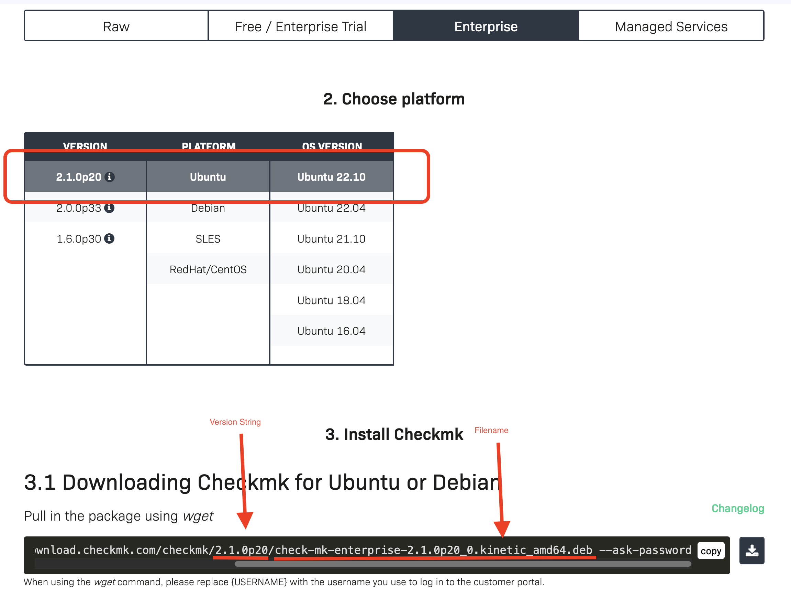

# Checkmk Site Management

The Included Playbook cmk_server_mngmnt.yml makes use of the following functions:

- Installation of Checkmk Versions
- Creation of Checkmk Sites
- Updates of Checkmk Sites

## How It works

Configure your Checkmk Target Version, and your Checkmk Sites inside the Syncer. 
Then run the Playbook.  The Configuration can be Found in **Rules→ Checkmk**

Now the Details:

### CMK Server Settings
**Rules →Checkmk →CMK Server Settings**  
Here you set the Target Version you want to use. The needed information can be found on the Checkmk Download Page:

If you place the Checkmk Installation Package under /tmp it will be used. If not, the System will try to download it, using the supplied credentials. Then it's transferred to your remote server. That means these servers do not need an internet connection.

When you create a rule, you find the following options:

| Option | Description |
|:-------|:------------|
| Name | Name of config set |
| Server User | User for Ansible to connect to the Server. Sudo needs to be possibe |
| CMK Version | Version's String like 2.1.0p19 |
| CMK Edition | Enterprise or RAW |
|CMK Version Filename | Filename like found on the cmk download server, example: check-mk-enterprise-{{CMK_VERSION}}_0.bullseye_amd64.deb |
| Inital Password | This password will be set for new sites |
|Subscription Username/ Password | Your Checkmk Subscription Account |

Note: For the CMK Version Filename, you can use the Placeholders {{CMK_VERSION}} and {{CMK_EDITION}}

### CMK Sever Sites
**Rules →Checkmk →CMK Server Sites**  
As Second you add all your Sites here. Every Entry references to a Server Setting entry.
Make sure that the operating system will match to the Server Settings.

| Option | Description |
|:-------|:------------|
| name | Site Name |
| Server Address | Address of Server for SSH (without protocoll) |
| Settings Master | Select the CMK Server Settings Entry |

As a current limit, the System can only manage one Checkmk Site per Server. 

### Run the automation
With the settings done, you can run Ansible now.

`ansible-playbook -i cmk_server_inventory cmk_server_mngmt.yml`

