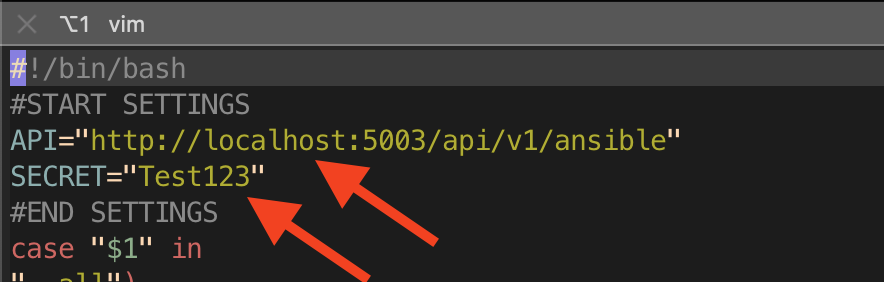
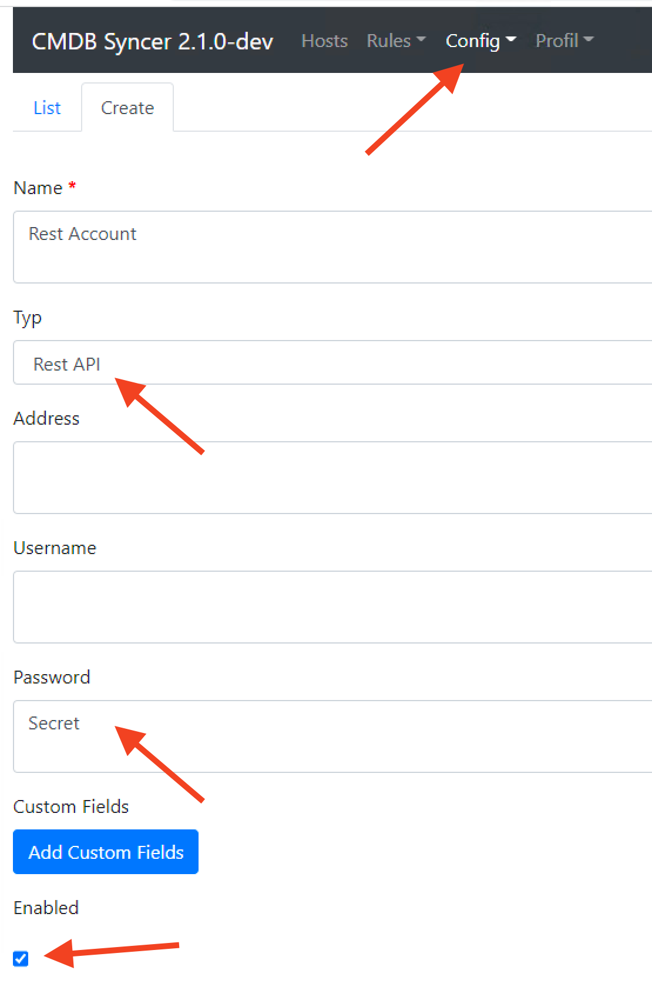

# Ansible Integration
The CMDB Syncer contains Ansible Endpoints and a set of Ansible Playbooks.
As of now, you can basically controll all of your own playbooks with rule based variables from the syncer, or use the providedd ones for Update and Register of Checkmk Agents (Linux/ Windows) or the Managementt and Installation of Checkmk Sites on your Servers.

## Config Tricks
If you want to refer to Passwords in your Syncer Configuration, you can use an Integrated Marco called ACCOUNT who connects you to every Field which you can set in the Account config.  The Syntax is MACRONAME:ACCOUNTNAME:FIELDNAME.

Therefore , to get the Password of account cmk, it would look like:
```
{{ACCOUNT:cmk:password}}
```


## General

Inside the Ansible subfolder, you will find a set of inventory plugins for Ansible.
These are for use with the ansible-playbook command, behind the -i parameter.

As of now, these are:

| File | Description |
|:----|:-----------|
| inventory | General Inventory source for local installation |
| docker_inventory | Inventory source when running in docker | 
| rest_inventory | Example for Inventory Source using the Rest API of Syncer |
| cmk_server_inventory | Special source for use with the cmk_server_mngm.yml playbook |
| cmk_server_docker_inventory | Like above |


Also you find two playbooks and two roles:

| File | Description |
|:----|:-----------|
| cmk_agent_mngmt.yml| The complete Managment of the Agent Installations of Checkmk | 
| cmk_server_mngmnt.yml| The Update and Installation of Checkmk Sites and Versions. |

From here you can copy and adapt these scripts to your need (when so, prefix with local_) or just use the provided ones.

## Use the Ansible Playbooks directly inside Syncer
If you not have an Ansible installation or the Ansible Knowledge, you can just run the included stuff from inside the Syncers Folder. Just make sure to install the additional requirements at the first time: pip install -r ./ansible/requirements.txt

After that, the Workfloww is: 

- Change into the CMDB Syncer Directory
- Load his environment (source ENV/bin/activate)
- Change to the ansible subdir: cd ./ansible
-  You are Ready

## Remote Installation
If you want to use the Syncers script, but from adifferentt server and to connectt via Rest API,
these are the Steps:

- [Checkout the Repo](setup_code.md)
- Copy the Inventory File: cp rest_inventory local_rest_inventory
- Edit the File and set the URL (beware of Proxy) to the Syncer Installation, and set a Secret:
- 

- The Secret is set up in the Account:
- 
- You are Ready

## Run Ansible
You can run Ansible now with the wanted Play books. I would recommend to always check with the debug_host feature of the Ansible Module, which Variables are set. From here one, it's normal ansible:

`ansible-playbook -i INVENTORY_SOURCE --limit somehost cmk_agent_mngmt.yml`

