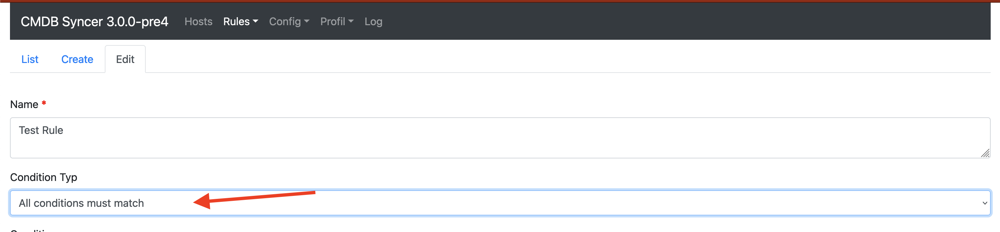
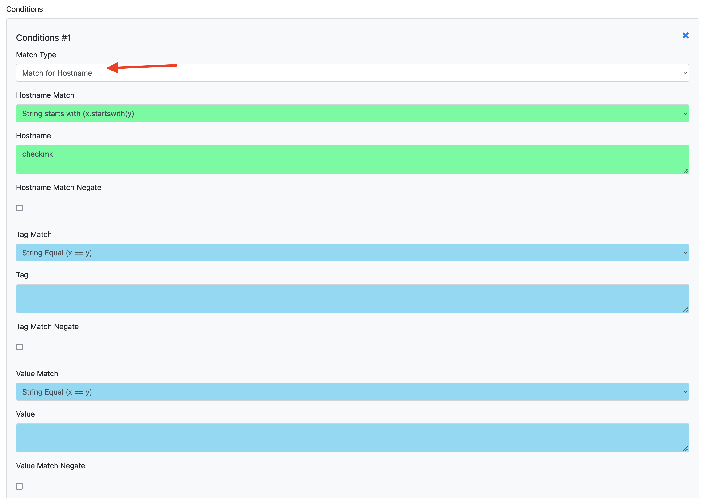

# Rule Conditions
Every Rule has a Condition. And you have the power to match everything. Hosts or attributes with different options.
Make sure to set for the Condition, if an Attribute or a Host match is required. Sadly, the Frontend always shows all input fields due to current limitations. Also, it's required to set how the conditions should be applied.

They can match "ANY", what means one matching condition will be enough for the rule to match. If set to "ALL", all conditions need to match. Put "Anyway" and the Rule will match without condition.

::: application.modules.rule.models.FullCondition
    options:
      show_source: false
