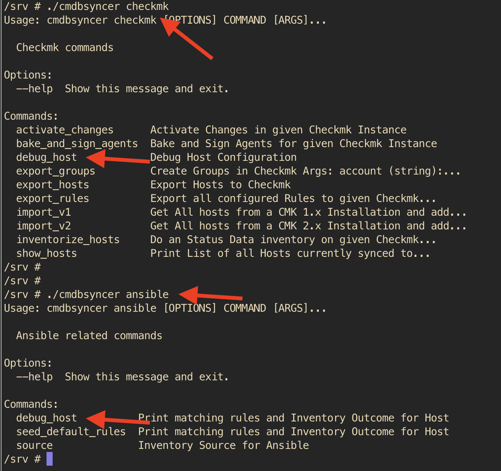

#Debug Rules
The options you have can lead to a complex outcome.
So, best is, to check this outcome on a set of hosts.

For that, every export module contains a debug_host option.
It's called in the CLI, by the Module as identifier.

See here the examples for Checkmk and Ansible:

If you then query a host, you see the tables with information about which Rules are applied and which attributes used;

