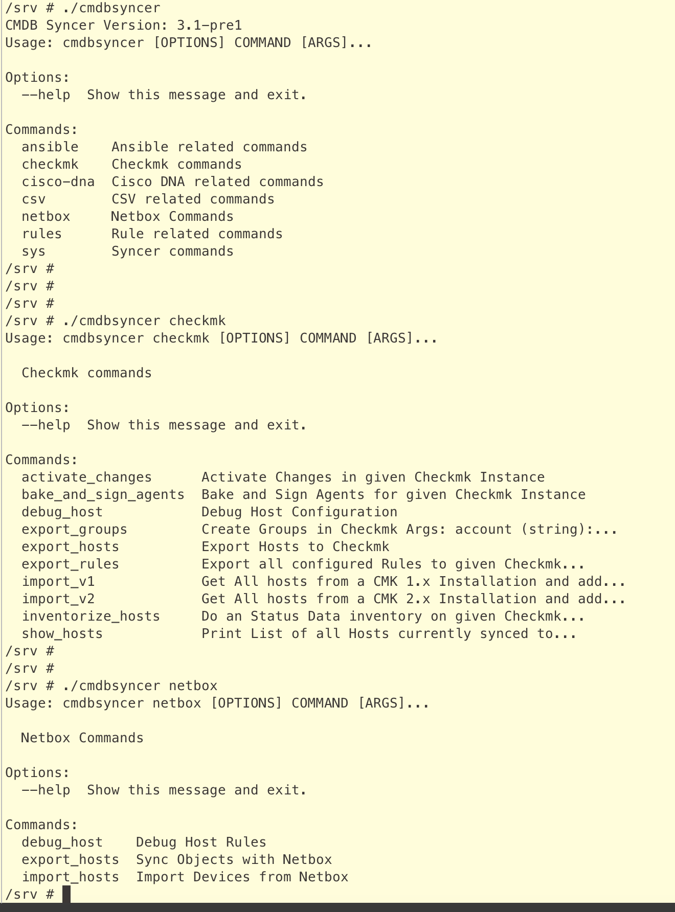

# First Steps
Depending on, if you are on docker or local, you need to change into the docker container or enable the Virtual Environment for the following functions

## Create first User
When you have the Setup Done, you have to create a user to login into the Web interface.

`./cmdbsyncer sys create_user mail@address.org`

The command shows you a password. In case you have forgotten the password, our locked yourself out with the 2FA Function, this command will reset everything.

## Explore the Command line Options
The Command Line offers you access to almost every function. 
It's separated in different areas. So, you can go deeper and deeper into the options.

Example:

