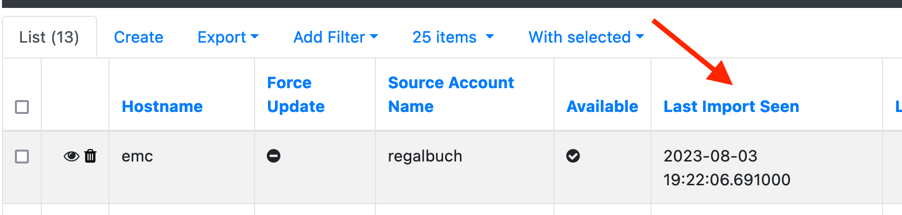
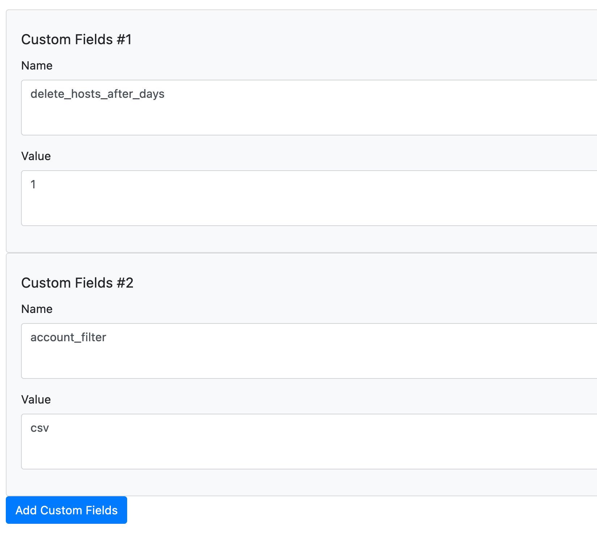

# Remove Hosts, or Maintenance
We covered now that Hosts are imported to the Syncer, and that they are exported to other systems based on rules.  But what happens, if a host is not longer part of your CMDB? For example, when it's retired.  That would mean, the Import Plugin will not find this Host any more.
But only the Hosts found by the Import Plugin, will be marked as be seen:

It can now be configured when you want them to be deleted by the Syncer. Deleting them from Syncer, will also mean they will be deleted from the systems you export to, example from Checkmk.

The recommended way is to use the [Cron Feature](cron.md) and set a Cronjob to do that.
For that, create an [Account](accounts.md), set it to Mode "Maintenance" and use that as configuration. There you can set after how many Days you want to delete, and you can filter from which source only you would like to delete.

From Command line without the Cron Feature, use:

<pre>
/cmdbsyncer sys maintenanc DAYS
</pre>

To remove after days or refer to your account with --account
