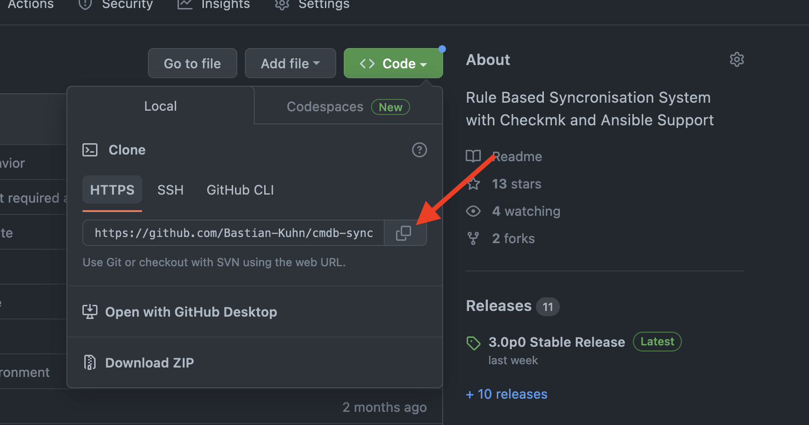

# Installation from Code

The most common way to use the application without Docker is direct from Code. This is easy if the server has an Internet Connections. Updates are easy as git pull then.


## Download Repo
You need to check out the Code directly from GitHub.  Go to the Repo, and copy the Clone URL to example /var/www. In all examples, this Path is used.

[Repo](https://github.com/kuhn-ruess/cmdbsyncer)



Example:
```
cd /var/www
git clone https://github.com/kuhn-ruess/cmdbsyncer
cd cmdbsyncer
```


## Install Pythons Virtual Environment.
The Syncer Need some Python Libraries. But these we don't want to install into your system.
Instead, we create a virtual environment. Make sure that you have at least python3.9. The Python Interpreter on your system may have a different Name.

Make always sure you are in /var/www/cmdbsyncer

`python3.9 -m venv ENV`

This Environment needs to be loaded from now on, every time somthing is done with the syncer, also for every Cronjob which you will run.

`source ENV/bin/activate`

To this Environment, you install the Python Libraries. This is done with just one Command:

`pip install -r requirements.txt`

In Case, you plan to use Ansible, also import theAnsiblee requirements:

`pip install -r ./ansible/requirements.txt`

## Install Mongodb Server
The Syncer needs the Mongodb. All you need to do is to install it, with your Packet Manager. Then you are ready to go.


## The Web Interface

To have a brief look, you can start the development Server:

`flask run --host 0.0.0.0 --port 8080`

But then you should Setup UWSGI. There is an Example with [UWSGI and Apache](uwsgi_apache.md), but it's even easier with NGINX.


## First Steps

Make the [First Steps](first_steps.md)
