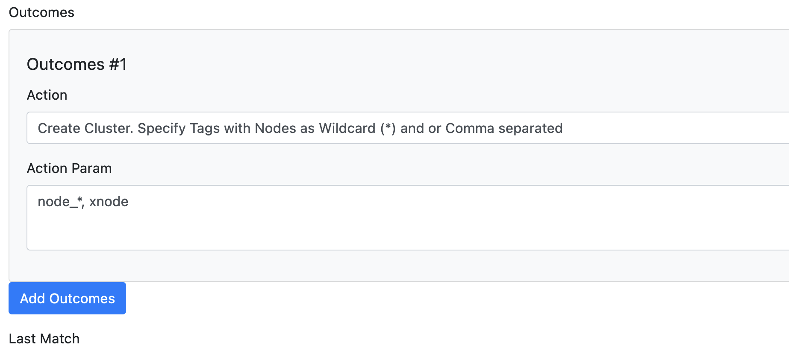

# Create Clusters in Checkmk

With the _Create Cluster_ Rule Outcome (See [Export Rules](export_rules.md)) its possible to create Checkmk Cluster Hosts instead of Normal Hosts.

Since these Nodes have to exist in Checkmk, clusters will always create add the end of the export. But besides that, they act as normal Hosts and will honour all the configured other Settings in the Syncer.

The difference is, that a Cluster Host needs to have a List of Nodes assigned.
This Information needs to come in the Form of Attributes. You get Attributes from your CMDB, or you can add them using the [CSV Features](/csv).

You can then directly specify the Name of this Attributes in the rule, and you have the possibility to add a Wildcard add the end of an entry, to match all attributes starting with this name.

Multiple Attributes can be comma separated, and you can also mix Wildcard and not Wildcards.

An Example Rule can look like this:

In fact, this is all extra information to know, since everything else works like the Other rules. So, no special export command is used. 

