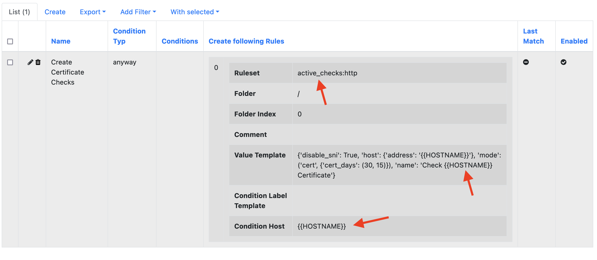
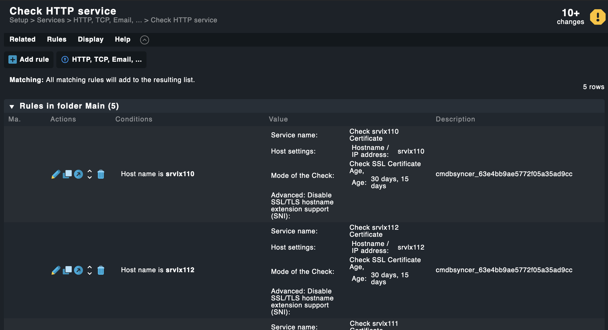

# Automatically Create Rules

Like the principle described [here](recipe_contact_groups.md) the Syncer can also create all Kinds of Rules, even Active Checkmk Checks.

This Recipe will not go in Detail how to obtain the Needed Information, instead just showing the Example Syncer Rule. The Details you find in the mentioned link.

Fist in Checkmk create one Example Rule of the Type you want, configure it the way you want.

Copy the Rule Name and the API Value like described [here](recipe_contact_groups.md) and create a new Syncer Rule in 

**Rules → Checkmk → CMK Rules Management** 

As Rule Condition, you set for which hosts you want to create the Checkmk Rule.
Then replace in the API Value with {{HOSTNAME}} where you need it (or use with the same Syntax every other Attribute of the host) and put it in the Value Template Field. 

Most likely, in this example, the condition_label_template stays empty and you just place {{HOSTNAME}} as Condition host. Technically, you can add more than one Hostname comma separated, if this makes sense. Since this Field also supports Jinja, you can do all Jinja Magic with your Labels, which result in a Comma separated list. 

The Fields for Value Tamplate, and Condition Template of course also support [Jinja](https://jinja.palletsprojects.com)

This is what Active Checks for Certificates would look like:

Result in Checkmk for that:

