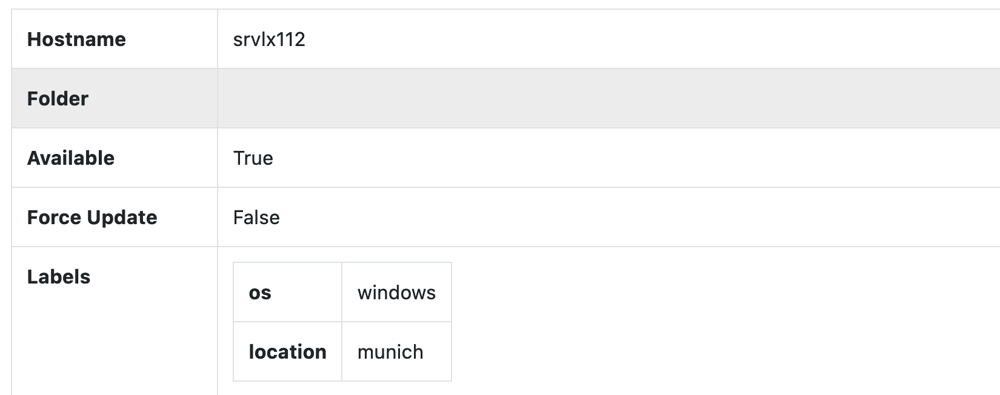
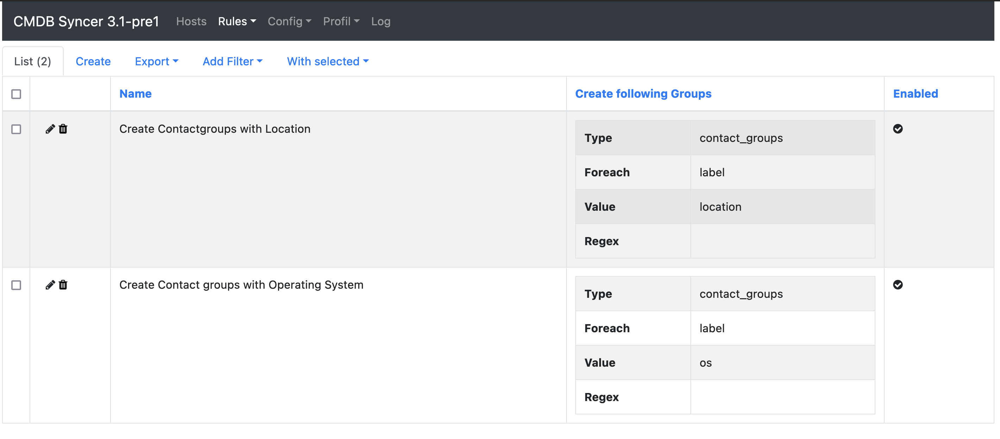
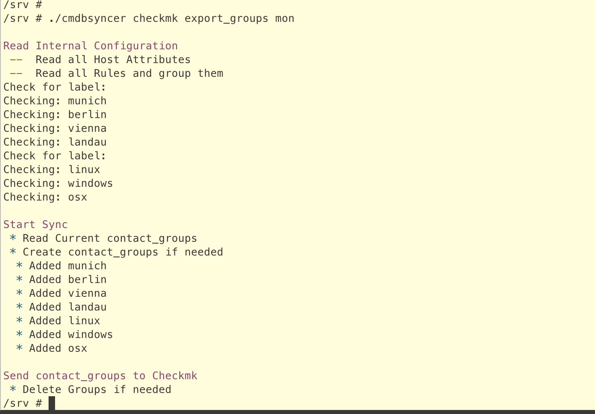
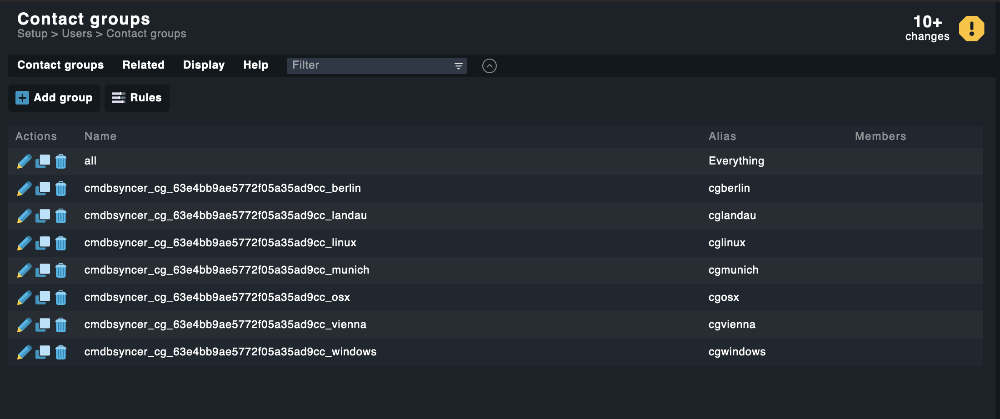
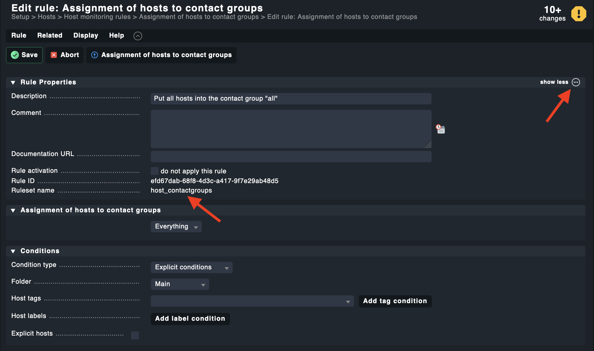
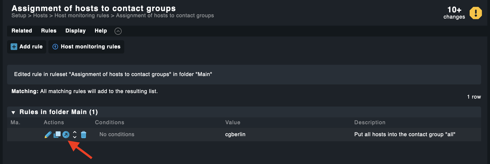
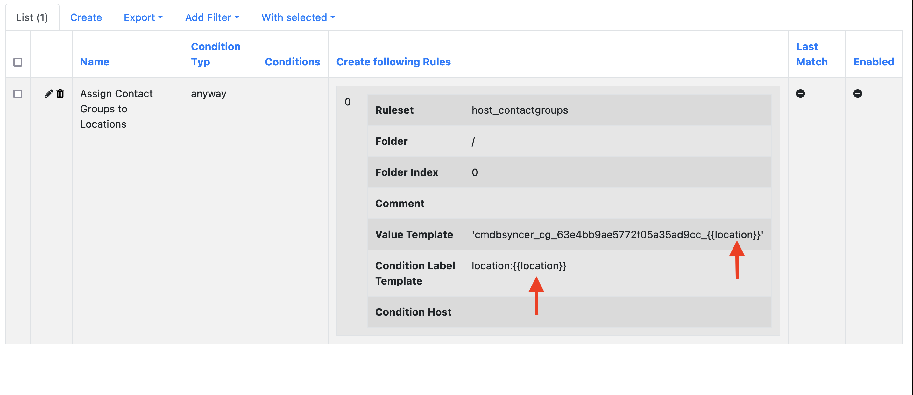
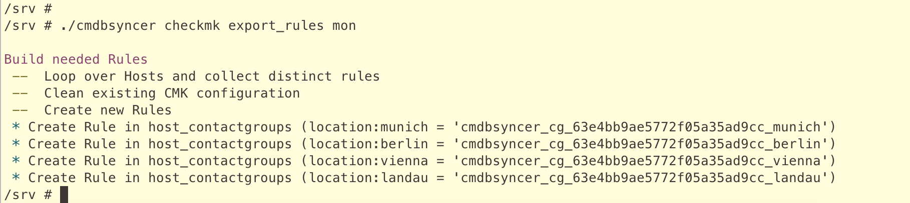

# Manage Checkmk Contact Groups
If you want to manage contact groups with the Syncer including the creation of the assignment rules, some things need to be prepared.

1. You need to have Hosts with the Attributes which have the Names of the wanted groups.
2. You have to create these groups. This is described here: [Groups Management](groups_management.md)
3. You have to create the Assignment Rules. This can be done with the [Rules Management](rules_management.md) Feature.

As a simple Example, we want to create Contact Groups for Location and Operating System of the Host.

## The Attributes
Using the Import, or the Inventory functions, the Hosts must have the Attributes. In our example, we go with: **os** and **location**.

## The Group's Rule
First we create the Rule for creating the Groups.
**Rules → Checkmk → CMK Groups Management** 
Since the information is clean, you don't need to fill the Rewrite or the Rewrite Title.
But if you want to change something, could do for example:
Rewrite: cg_{{name|lower}}
Rewrite Title: {{name|capitalize}}
Note: The Screenshot show Regex instead of the new Rewrite Fields

The sync will send them then to Checkmk:

Where you find them:

(Please note that in the current Version, no syncer Prefixes needed any more because of an internal cache). 

HINT: If you have values like contact_1 to contact_x, you can also use contact_* as a Wildcard for the value to trigger all values starting with the string. Only works at the End of the string.

## The Assignment Rule
Now you create a normal Checkmk rule. Even that this example shows the Assignment of Hosts to Contact groups, you can adapt it to every other Rule type.

### Figure out the Rule properties
To configure the Syncer, you need to have the Rule properties. You can find them, when you navigate to the rule in Checkmk:

You need to Ruleset Name:

And the Value Representation of it:

Then:

You notice the syncer_id prefix in there. 

### Setup the Rule
**Rules → Checkmk → CMK Rules Management** 

This Rule now can have conditions, that is useful if you want to use {{hostname}} as a placeholder.  In our case, it's only about creating a Checkmk rule, which has a simple label condition. 

This looks just like this:

Note the {{ location }} Jinja Placeholder. With this Syntax, you can refer to every Attribute. And you can do every operation which [Jinja](https://jinja.palletsprojects.com/) can do. 

For os, you just repeat this step and replace location with os.

And now we can run the export:

Check the Result in Checkmk:

Thats it, after Activate the Changes it's done.

