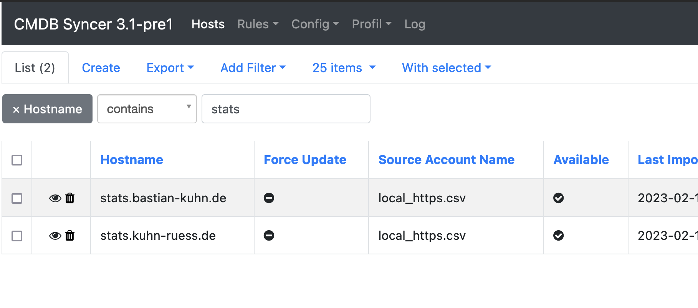
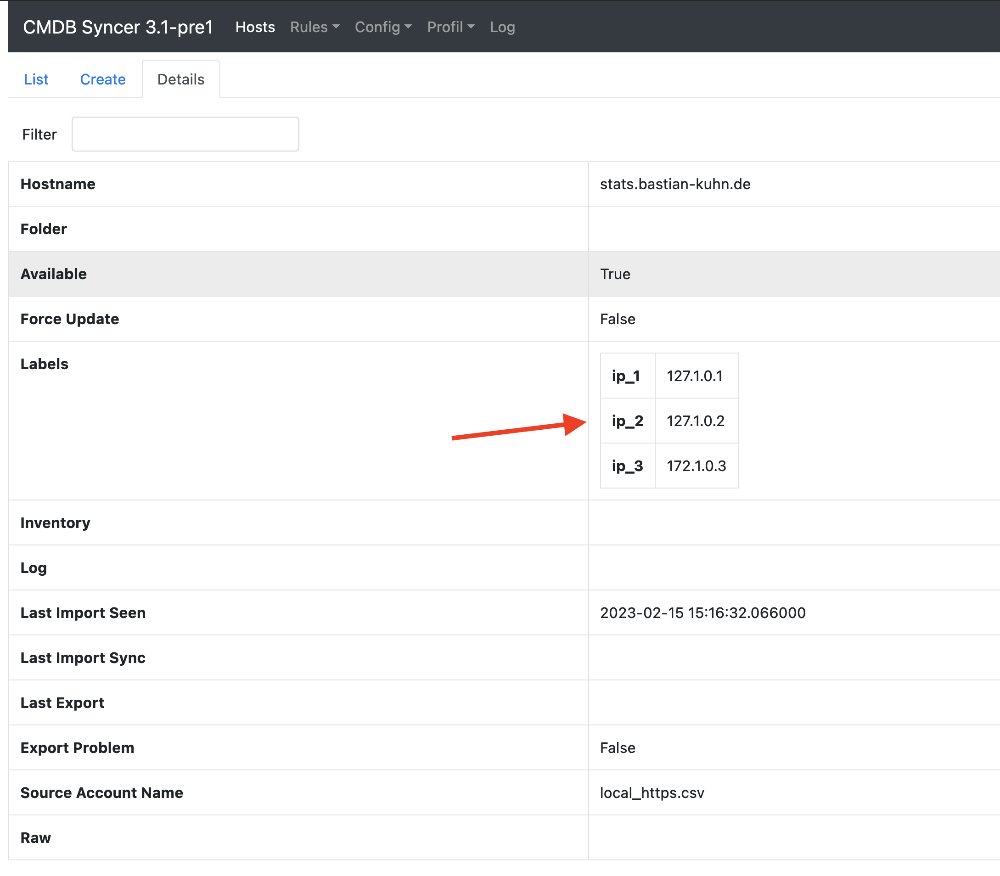
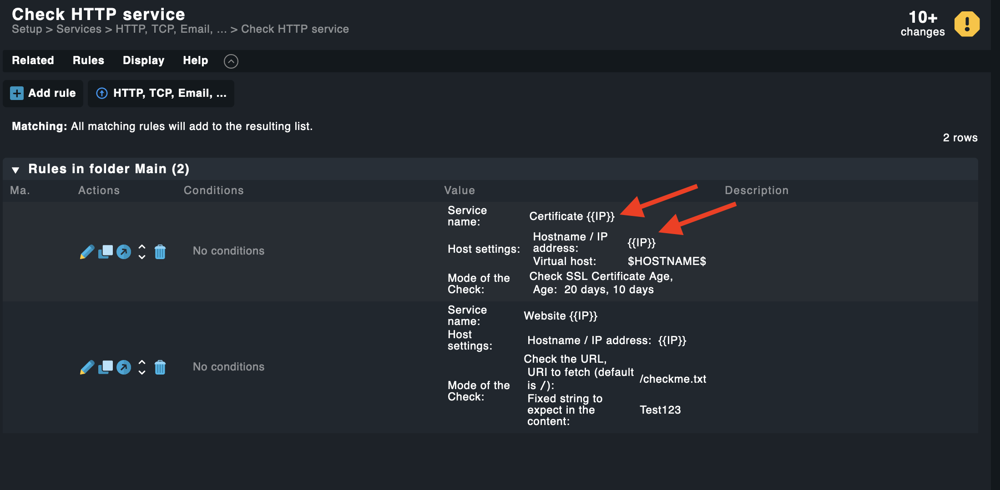
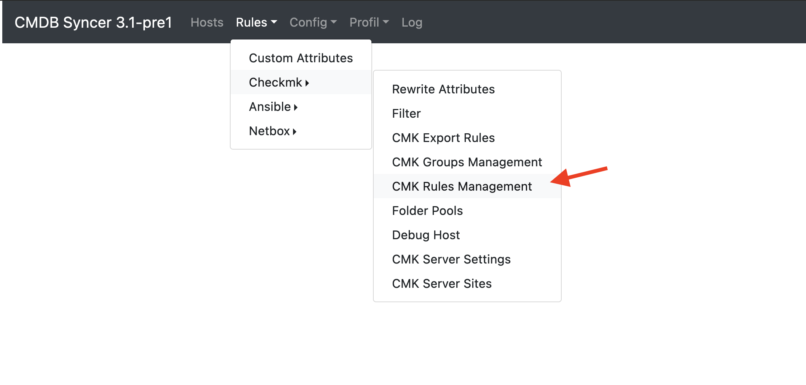
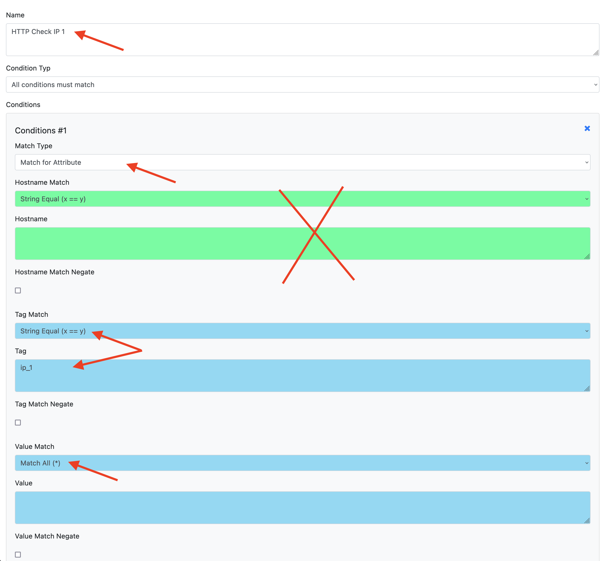
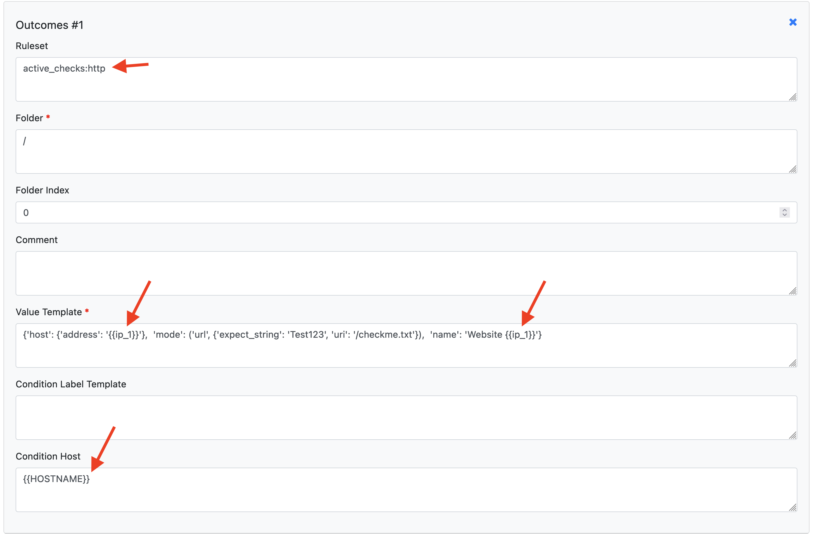
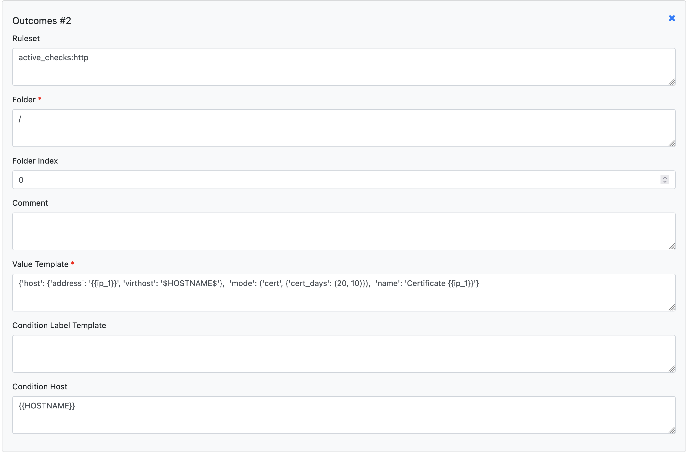
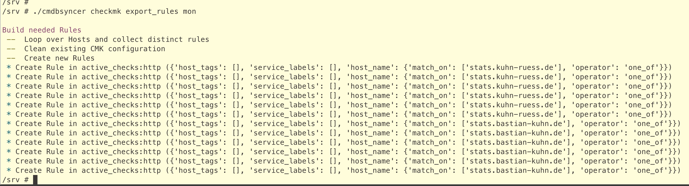
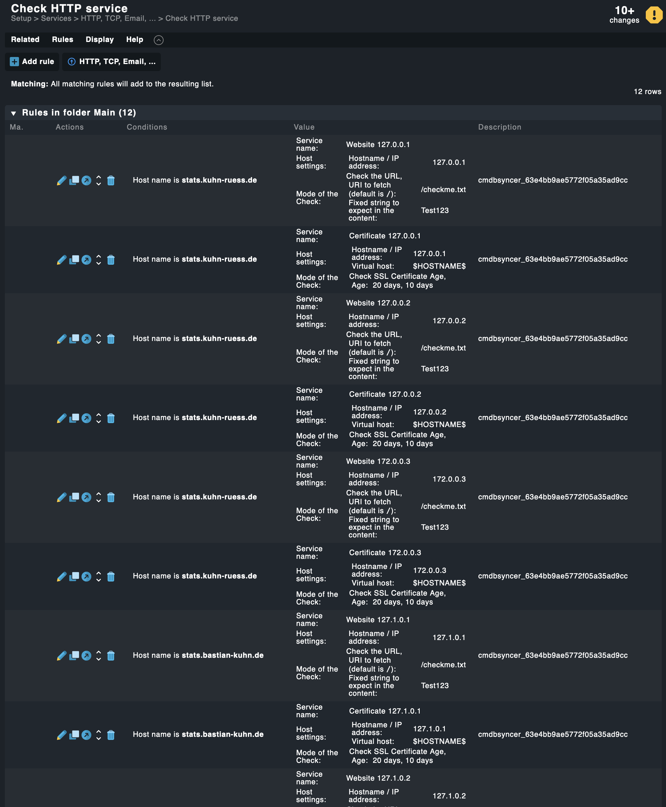

# Create a bunch of multiple HTTP Rules
In this example I explain, how you can add Multiple HTTP Checks for Website and Certificates, based on Multiple IP Addresses. 

## What you need:
- A Data Source Containing this Information (maybe just CSV?)
- One Rule in the Syncer for Each IP
- Perhaps create an Example rule for each type in Checkmk.
This article will cover every step.

## The Data Source
For the Example I use a Simple CSV, which a Column for each of my IP Addresses, and two hosts:

This file I import as Main Source into the Syncer:

Where I find them then:

The Details show me the IP Attributes:

## Find out the Rule Parameters

As a next step, I create the two example Rules I want to have in Order to copy their API Attributes. This is documented in Detail here: [Recipe Checkmk Rules](recipe_checkmk_rules.md)

To make the replacement of Values easier for me, i already use {{IP}} for all places, I want to have my dynamic IPs later on.

## Create The Syncer Rules.
In the Syncer change to tue CMK Rules Menue:

Hit the Create button and I show for the first IP Example how to set up the rule. Repeat the Step for all the other IPs.

The Rule needs to have one condition. This is to check if the Label exists for the Host.
Please note here, the Match Type is set to attribute, so the Green Host Match Field is not used. In the Blue Fields, the Attribute Name ip_1 needs to exist, but can have any content (Match ALL)

But Since I want to have two checks for each IP, I also add two Outcomes for the Rule.
The first is for the normal HTTP Check. Here I replace IP with my first label, ip_1

The Second Outcome is for the Certificate Check. 
Here I do the same Replacements.

Make sure to Enable the rule and hit Save.
Repeat this for ip_2 and ip_3.

## Sync the Rules
The Final Step is to sync the rules to Checkmk. Make sure to delete your example rules, of course. And no Checkmk Activation is needed, you can wait to the end.
If you followed this example, don't forget to use the export_hosts to create your example hosts in Checkmk.

To sync the rules, run export rules. In my environment, the Account name is set to mon. So, it looks like this:

## In Checkmk
Only left is to see the Outcome in Checkmk, and Activate the Changes:

