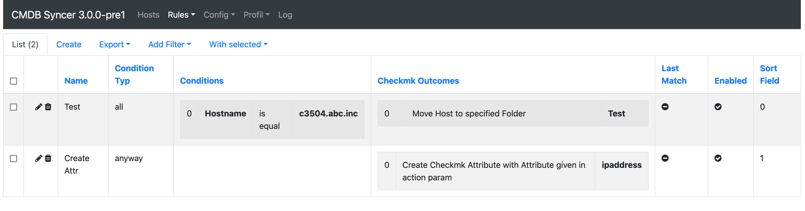
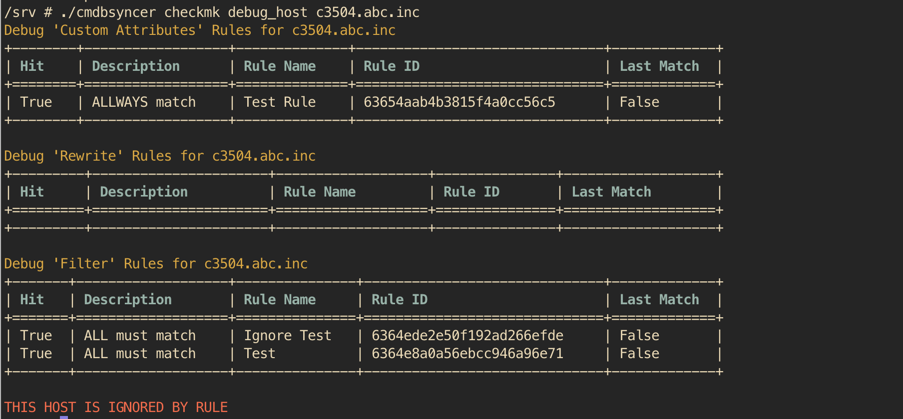

# Welcome to the CMDB Syncer

Rule Based and Modular System to syncronize Hosts into and between Checkmk, Netbox and other Systems.
Main Goal is the complete Organization of the Hosts based on CMDB Systems

## Main Functions
* Web Interface with Login, 2FA and User management
* All configuration besides Installation in Web Interface
* Simple Plugin API to integrate own Data Sources
* Various Debug Options with the ./cmdbsyncer command
* Rules to control the Synchronization:
  * Based on Host Attributes
  * Attribute Rewrites
  * Filters
  * Action Rules

## Modules and Functions

### Checkmk
* Manges full Host Lifecycle (creation, labels, folders, deletion)
* Sync and Update all possible Host Attributes
* Full management of Checkmk Folders or even own Targets (Target must not be Checkmk, also Checkmk can be the source instead of a CMDB).
* Folder Pool Feature to split big amounts of Hosts automatticly between folders (and therfore sites).
* Creation of Host-, Contact- and Service Groups
* Create Host Tags
* Create BI Aggregations
* Integrated options to prevent to many Updates in Checkmk
* Command to Active Configuration
* Command to Bake and Sign Agents
* Management of Checkmk (Fallback) users (Create/ Delete/ Reset Password/ Disable Login)
* Inventory for Host Attributes (need e.g. for Ansible, like on which site is server on)

### Ansible
* Rule Based Inventory Source
* All Functions for Checkmk Agent Management (Installation, TLS Registration, Bakery Registration)
* Linux and Windows

### Netbox
* Rulebased Export and Import Devices to Netbox

### Cisco DNA
* Import devices and their Interface Information

### CSV
* Manage Hosts based on CSV File (Import Source)
* Add Addional Informationen from CSV Files to your Hosts (eg. Overwrite IP Addresses)

## LDAP
 - Import Objects from LDAP Directories

## RestAPI
- Import of Custom Rest APIs

## JSON
- Import of Json File Structures

## MySQL
- Import of Mysql Database Tables
