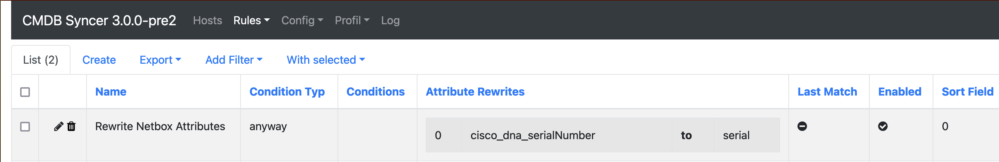
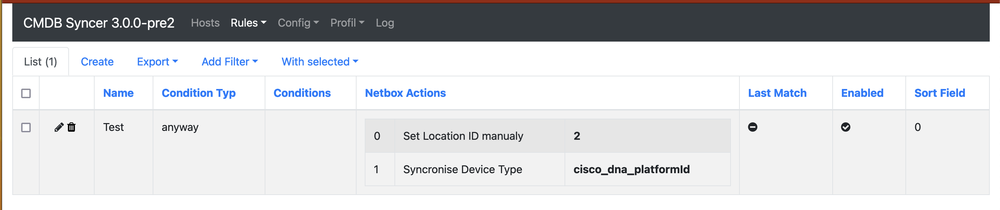
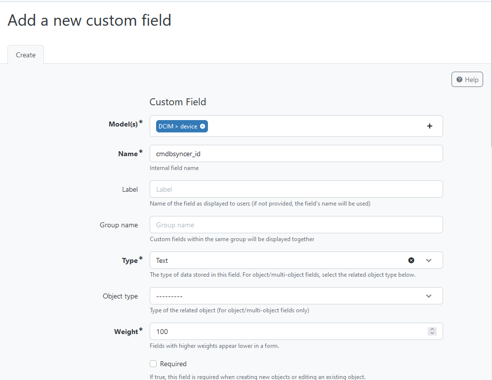

# Netbox
If you want to sync your Hosts to Netbox, you find all information how to set this up here.
Your Hosts will be created as Devices. If you'd like to, you can also Synchronize Interfaces to Netbox.
As of now, the Source for Interface Data must be Cisco DNA, but this can and will change in the future for a more general support.

## Devices (Hosts)
To create Devices in Netbox, in some cases it's needed to create extra Netbox Entries and reference them. The CMDB Syncer will do that for you if you configure it. Other Fields are just Normal String Fields.

### Required Fields Overview
- Device Role
- Device Type
- Site
- Status

### Normal Fields
Normal Netbox Text Fields can be synced with every attribute your Host in the Syncer has.
You just need to make sure to rewrite them to the Netbox Name. (See: [[AttributeRewrite]])
Example:

The supported Fields are
- serial
- comment
- primary_ip4
- primary_ip6
- face (rear/front)

### Fields which need Reference
The Following Fields need to set a Reference.
You can ignore this fields if not required. Also, you can sync them with your Attributes, so CMDB Syncer will create them. And as last Resort, you can Hardcode the ID. This is done in the Custom Attributes Rule. Example:

**Fields Support Sync**
- Device Type
- Device Role
- Platform

**Other Fields**

#### Special Fields
Some of the Reference Fields need even a Reverence by themselves:

- Device Type → Manufacturer: The Attribute __manufacturer__ is needed on your host. Best would be adding this attribute in your import plugin. Some integrated plugins like Cisco DNA also handle the manufacturer attribute automatically. 

# Setup of Netbox
You need at Least an API Key, to Set up the Connection as Account in Syncer.
Also, you need to Set up a Reference Field for the Devices, that the Syncer can mark systems owned by him.

 

